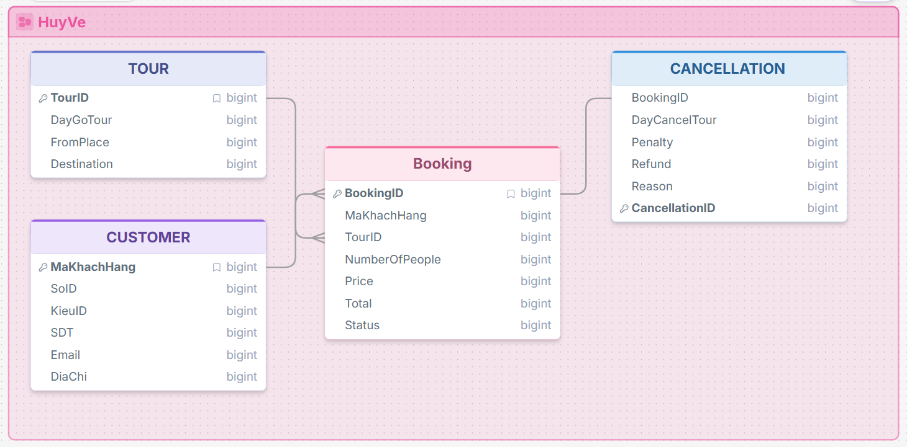

# Thiết kế cơ sở dữ liệu hệ thống hủy vé

## B1. Khảo sát yêu cầu nghiệp vụ

- Hệ thống quản lý việc khách hàng đặt và hủy tour. Trong đó có:
  - Khách hàng
  - Tour
  - Booking
  - Yêu cầu hủy booking

### Quy trình hủy vé

1. Nhân viên kiểm tra khách hàng hủy cách ngày khởi hành bao lâu.
2. Tính `Penalty`.
3. Xác nhận `Status` hủy booking.

---

## B2. Xác định thực thể và thuộc tính

### CUSTOMER

Lưu thông tin khách hàng.

**Bài yêu cầu:**

- `SoID`
- `KieuID`
- `SDT`
- `Email`
- `DiaChi`

### TOUR

Lưu thông tin tour.

**Bài yêu cầu:**

- `DayGoTour`
- `FromPlace`
- `Destination`

### BOOKING

Lưu thông tin đặt tour.

**Bài yêu cầu:**

- `NumberOfPeople`
- `Price`
- `Total`
- `Status`

### CANCELLATION

Lưu thông tin hủy tour.

**Bài yêu cầu:**

- `DayCancelTour`
- `Penalty`
- `Refund`
- `Reason`

---

## B3. Xác định mối quan hệ

- `CUSTOMER 1 ───── N BOOKING`
- `TOUR 1 ───── N BOOKING`
- `BOOKING 1 ───── 1 CANCELLATION`

---

## B4. Vẽ lược đồ E-R



---

## B5. Chuyển E-R sang mô hình quan hệ

Chuyển 4 thực thể thành 4 bảng:

- `CUSTOMER`
- `TOUR`
- `BOOKING`
- `CANCELLATION`

### Quy tắc

- Trong quan hệ `1-N`, khóa chính của bảng phía `1` sẽ trở thành khóa ngoại của bảng phía `N`.
- Bảng `CANCELLATION` sẽ nhận `BookingID` làm khóa ngoại.
- Bảng `BOOKING` sẽ nhận `TourID` và `CustomerID` làm khóa ngoại.

### Mô hình quan hệ

```text
CUSTOMER(
    CustomerID PK,
    SoID,
    KieuID,
    SDT,
    Email,
    DiaChi
)

TOUR(
    TourID PK,
    DayGoTour,
    FromPlace,
    Destination
)

BOOKING(
    BookingID PK,
    CustomerID FK,
    TourID FK,
    NumberOfPeople,
    Price,
    Total,
    Status
)

CANCELLATION(
    CancellationID PK,
    BookingID FK,
    DayCancelTour,
    Penalty,
    Refund,
    Reason
)