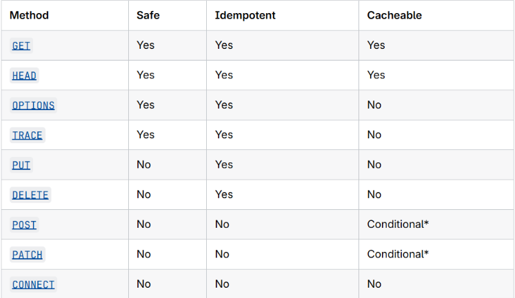
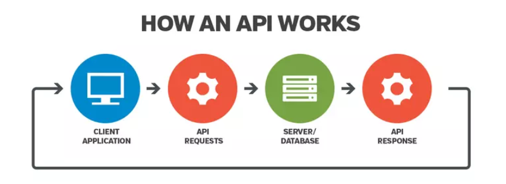

# 1. HTTP

## 1.1 HTTP là gì?

HTTP là một giao thức dùng để lấy các tài nguyên như tài liệu HTML. Đây là nền tảng của mọi hoạt động trao đổi dữ liệu trên Web và nó là một giao thức Client-Server, có nghĩa là các Request được khởi tạo bởi Client, thường là trình duyệt Web.

---

## 1.2 Cấu trúc cơ bản của HTTP

* Qua sơ đồ bên dưới, các bạn sẽ thấy được cấu trúc khá đơn giản của một ứng dụng Web và mô tả cụ thể vị trí của HTTP là gì:

* Giao thức HTTP là gì?

  HTTP còn là một giao thức **Yêu cầu – Phản hồi (Request – Response)** dựa trên cấu trúc **Client – Server**.

  Client và Server giao tiếp với nhau bằng cách trao đổi các **message (thông điệp)** độc lập, trái ngược với một luồng dữ liệu.

  * Các message được gửi bởi Client, thông thường là một trình duyệt Web, được gọi là **Request**.
  * Message được gửi bởi Server như một sự trả lời được gọi là **Response**.

---

## 1.3 Request and Response

* Một **HTTP Request** là một message được gửi bởi Client (như trình duyệt Web) đến Server để yêu cầu một tài nguyên hoặc kích hoạt một hành động.
* Một **HTTP Response** là message mà Server gửi lại cho Client, chứa kết quả hoặc dữ liệu được yêu cầu.

### HTTP Request

Một HTTP Request bao gồm ba phần chính:

#### + Request Line

* Chứa **HTTP Method** (hành động cần thực hiện), **URI/target path** (nơi tài nguyên tồn tại) và **HTTP version**.

* Định dạng như sau:

```http
GET /BookStore/v1/Books HTTP/1.1
```

#### + Headers

* Metadata cung cấp thông tin về Client, chẳng hạn như loại trình duyệt (`User-Agent`) hoặc những định dạng mà trình duyệt chấp nhận (`Accept`).

#### + Body

* Là dữ liệu thực tế được gửi đi.
* Phần này là tùy chọn và thường được sử dụng trong các Request như `POST` hoặc `PUT` để gửi dữ liệu biểu mẫu hoặc tải tệp lên Server.

Ví dụ:

```http
POST /BookStore/v1/Books HTTP/1.1
Host: example.com
Content-Type: application/json
Accept: application/json

{
    "title": "Java cơ bản",
    "author": "Nguyen Van A",
    "price": 50000
}
```

---

### HTTP Response

Một HTTP Response cũng bao gồm ba thành phần chính:

#### + Status Line

* Bao gồm HTTP version, một mã trạng thái dạng số (cho biết thành công hoặc thất bại) và một đoạn mô tả ngắn.

#### + Headers

* Metadata về Response, chẳng hạn như phần mềm Server, ngày tháng và kiểu dữ liệu.

#### + Body

* Nội dung được Client yêu cầu.
* Đây có thể là mã HTML của một trang Web, một tệp hình ảnh hoặc dữ liệu thô từ một API.

---

### Status Code của Response

* **1xx: Information (Thông tin)**

  Khi nhận được những mã như vậy tức là Request đã được Server tiếp nhận và quá trình xử lý Request đang được tiếp tục.

* **2xx: Success (Thành công)**

  Khi nhận được những mã như vậy tức là Request đã được Server tiếp nhận, hiểu và xử lý thành công.

* **3xx: Redirection (Chuyển hướng)**

  Mã trạng thái này cho biết Client cần có thêm hành động để hoàn thành Request.

* **4xx: Client Error (Lỗi Client)**

  Nó nghĩa là Request chứa cú pháp không chính xác hoặc không được thực hiện.

* **5xx: Server Error (Lỗi Server)**

  Nó nghĩa là Server thất bại với việc thực hiện một Request nhìn như có vẻ khả thi.

---

# 1.4 Methods

## GET

The GET method requests a representation of the specified resource. Requests using GET should only retrieve data and should not contain a request content.

→ Phương thức GET yêu cầu một biểu diễn của tài nguyên được chỉ định. Các Request sử dụng GET chỉ nên lấy dữ liệu và không nên chứa nội dung Request.

---

## HEAD

The HEAD method asks for a response identical to a GET request, but without a response body.

→ Phương thức HEAD yêu cầu một Response giống hệt như GET Request, nhưng không có Response Body.

---

## POST

The POST method submits an entity to the specified resource, often causing a change in state or side effects on the server.

→ Phương thức POST gửi một thực thể đến tài nguyên được chỉ định, thường gây ra sự thay đổi trạng thái hoặc các tác động phụ trên Server.

---

## PUT

The PUT method replaces all current representations of the target resource with the request content.

→ Phương thức PUT thay thế tất cả các biểu diễn hiện tại của tài nguyên đích bằng nội dung Request.

---

## DELETE

The DELETE method deletes the specified resource.

→ Phương thức DELETE xóa tài nguyên được chỉ định.

---

## CONNECT

The CONNECT method establishes a tunnel to the server identified by the target resource.

→ Phương thức CONNECT thiết lập một đường hầm đến Server được xác định bởi tài nguyên đích.

---

## OPTIONS

The OPTIONS method describes the communication options for the target resource.

→ Phương thức OPTIONS mô tả các tùy chọn giao tiếp cho tài nguyên đích.

---

## TRACE

The TRACE method performs a message loop-back test along the path to the target resource.

→ Phương thức TRACE thực hiện một bài kiểm tra vòng lặp message trên đường dẫn đến tài nguyên đích.

---

## PATCH

The PATCH method applies partial modifications to a resource.

→ Phương thức PATCH áp dụng các thay đổi một phần cho một tài nguyên.

---

# 1.4.1 Đánh giá các HTTP Methods

Mỗi Method trong HTTP được đem ra đánh giá là:

### SAFE (Độ an toàn)

* Một Request trong HTTP Methods được xem là **Safe** khi sau rất nhiều lần gọi, nó vẫn không làm thay đổi Resource mà nó đang truy cập đến.

### IDEMPOTENT (Tính bất biến)

* Một Request được xem là **Idempotent** nếu sau nhiều lần gọi, nó vẫn trả về kết quả như nhau.

### VISIBILITY (Tính che giấu thông tin)

* Một Request trong HTTP Methods được xem là **Visibility** khi nó không để lộ ra thông tin trên URL khi Request được gửi.

### CACHEABLE (Có thể cache được)

* Một Request được xem là **Cacheable** khi sau lần gửi thứ nhất của Request, kết quả phản hồi có thể được lưu vào một trong các loại cache trên websites (`localStorage`, `cookies`, …).




# 2. API

## 2.1. API là gì?

* **API (Application Programming Interfaces)** là các cấu trúc được cung cấp trong các ngôn ngữ lập trình để cho phép các nhà phát triển tạo ra các chức năng phức tạp một cách dễ dàng hơn.

* API che giấu phần code phức tạp phía sau và cung cấp cho bạn một cú pháp đơn giản hơn để sử dụng thay thế.

### Ví dụ thực tế

* Hãy nghĩ về hệ thống cung cấp điện trong ngôi nhà, căn hộ hoặc nơi ở của bạn.

* Nếu bạn muốn sử dụng một thiết bị điện trong nhà, bạn chỉ cần cắm nó vào ổ điện và nó hoạt động.

* Bạn không cố gắng đấu dây trực tiếp thiết bị vào nguồn điện — làm như vậy sẽ thực sự không hiệu quả và nếu bạn không phải là một thợ điện thì việc thực hiện sẽ khó khăn và nguy hiểm.



---

## 2.2. REST API

* **REST API** là những API đi theo cấu trúc của **REST** và chúng tồn tại theo những quy luật chung nhất sau đây:

* Một **REST API (Representational State Transfer API)** cho phép giao tiếp giữa Client và Server thông qua HTTP.

* Nó trao đổi dữ liệu, thường ở định dạng **JSON**, bằng cách sử dụng các giao thức Web tiêu chuẩn.

  * Sử dụng các HTTP Methods như `GET`, `POST`, `PUT`, `PATCH` và `DELETE`.

  * Client gửi các Request đến các Endpoint của Server (URL).

  * Server trả về các Response như JSON, XML, HTML hoặc hình ảnh.

  * Ánh xạ các HTTP Methods với các thao tác **CRUD**:

    * **Create**: Tạo
    * **Read**: Đọc
    * **Update**: Cập nhật
    * **Delete**: Xóa

---

# 2.3. 6 nguyên tắc của REST

## 1. Client-Server Architecture: Tách biệt trách nhiệm

* REST được xây dựng dựa trên một ý tưởng đơn giản: **giữ Client và Server tách biệt nhau**.

* Client và Server giao tiếp với nhau thông qua Internet bằng các API Request, nhưng chúng vẫn là những thực thể độc lập.

---

## 2. Stateless: Mỗi Request hoạt động độc lập

* Server không có bộ nhớ.

* Mỗi Request từ Client phải chứa tất cả thông tin mà Server cần để hiểu và phản hồi Request đó.

* Server không ghi nhớ bạn đã làm gì năm giây trước hay năm phút trước.

---

## 3. Cacheable: Tối ưu hiệu năng thông minh

* Tại sao phải lấy cùng một dữ liệu lặp đi lặp lại khi dữ liệu đó chưa thay đổi?

* Nguyên tắc **Cacheable** cho phép Response được lưu trữ (**cached**) ở phía Client hoặc các Server trung gian, từ đó cải thiện hiệu năng một cách đáng kể.

---

## 4. Uniform Interface: Tính nhất quán

* **Uniform Interface** có nghĩa là mọi tương tác giữa Client và Server đều tuân theo những mẫu và quy tắc nhất quán, có thể dự đoán được.

---

## 5. Layered System: Hoạt động theo kiến trúc nhiều lớp

* Client không cần biết liệu nó đang giao tiếp trực tiếp với một Database Server hay đang đi qua một mạng lưới phức tạp gồm nhiều thành phần trung gian.

* REST sử dụng một kiến trúc nhiều lớp, trong đó nhiều hệ thống có thể nằm giữa Client và dữ liệu.

---

## 6. Code on Demand

* Có nghĩa là Server có thể gửi **code có thể thực thi** đến Client để mở rộng chức năng của Client một cách linh hoạt.

# 3. Design Pattern, DI và IoC

## 3.1. Design Pattern

* **Design Pattern**: Là các giải pháp tổng thể đã được tối ưu hóa, được tái sử dụng cho các vấn đề phổ biến trong thiết kế phần mềm mà chúng ta thường gặp phải hàng ngày.

* Đây là tập các giải pháp đã được suy nghĩ, đã được giải quyết trong những tình huống cụ thể.

* Những lập trình viên có thể áp dụng giải pháp này để giải quyết các vấn đề tương tự.

* **Design Pattern** có thể thực hiện được ở phần lớn các ngôn ngữ lập trình. Nó giúp bạn giải quyết vấn đề một cách tối ưu nhất.

### Tại sao phải sử dụng Design Pattern?

* Giúp sản phẩm của chúng ta linh hoạt, dễ dàng thay đổi và bảo trì hơn.

* Có một điều luôn xảy ra trong phát triển phần mềm, đó là sự thay đổi về yêu cầu. Lúc này hệ thống phình to, các tính năng mới được thêm vào trong khi **performance** cần được tối ưu hơn.

* Design Pattern cung cấp những giải pháp đã được tối ưu hóa, đã được kiểm chứng để giải quyết các vấn đề.

* Gặp bất kỳ khó khăn đối với những vấn đề đã được giải quyết rồi, Design Pattern là hướng đi giúp bạn giải quyết vấn đề thay vì tự tìm kiếm giải pháp tốn kém thời gian.

* Giúp cho các lập trình viên có thể hiểu code của người khác một cách nhanh chóng.

---

# 3.2. DI

* **DI - Dependency Injection**: Là kỹ thuật đưa **dependency** từ bên ngoài vào object thay vì để object tự tạo dependency.

* Nguyên tắc cơ bản của DI là làm cho **high-level module** phụ thuộc vào **low-level module** thông qua **injector**, hay nói cách khác, muốn tạo **instance high-level module**, ta phải tạo **instance của low-level module** và inject nó vào **high-level module** thông qua **injector**.

* Injector ở đây có thể là **constructor**, **setter** hay **interface**.

### Ví dụ không là DI

```java
public class ShapeManager {

    private Shape shape;

    public ShapeManager() {
        this.shape = new Circle();
    }

    public float calculatePerimeter() {
        return this.shape.getPerimeter();
    }

    public float calculateArea() {
        return this.shape.getArea();
    }

}
```

* Ở đây có **high-level** là `ShapeManager`, logic nghiệp vụ chính.

* **Low-level module** chứa chi tiết để high-level làm việc đó chính là `Circle`.

* Tuy nhiên high-level dính với low-level.

* Giả dụ mình muốn tính `Triangle` thì phải đổi.

* Nếu nâng lên thành 100 hình thì sẽ phiền phức hơn rất nhiều.

### DI phát biểu

> Class không tự tạo dependency cho nó mà dependency được cung cấp từ bên ngoài.

Ta làm:

```java
public ShapeManager(Shape shape) {
    this.shape = shape;
}
```

→ Thông qua **injector**, tức trong ví dụ này là **Constructor**, `ShapeManager` được cung cấp dependency từ bên ngoài.

---

# 3.3. IoC

* **IoC - Đảo ngược quyền điều khiển**: Là một nguyên lý trong thiết kế phần mềm, trong đó quyền kiểm soát việc tạo và quản lý đối tượng, dependency được chuyển từ chính class sang một thành phần bên ngoài.

### Không có IoC

```java
public class ShapeManager {

    private Shape shape;

    public ShapeManager() {
        this.shape = new Circle(5);
    }
}
```

→ `ShapeManager` tự quyết định dependency.

---

### Có IoC

```java
public class ShapeManager {

    private Shape shape;

    public void setShape(Shape shape) {
        this.shape = shape;
    }
}
```

→ `ShapeManager` không còn điều khiển và do bên ngoài điều khiển.

---

## 3.3.1. Mối quan hệ giữa IoC và DI

Dựa trên ví dụ trên có thể thấy **IoC giống DI**.

Ta hiểu như này:

* **IoC** là nguyên lý thay đổi quyền kiểm soát từ chính class sang thành phần bên ngoài.

* Còn **DI** là cách thực hiện IoC dùng **injector**.

* Ngoài DI ra còn có các cách như là **Service Locator**, **Event** để làm IoC.
