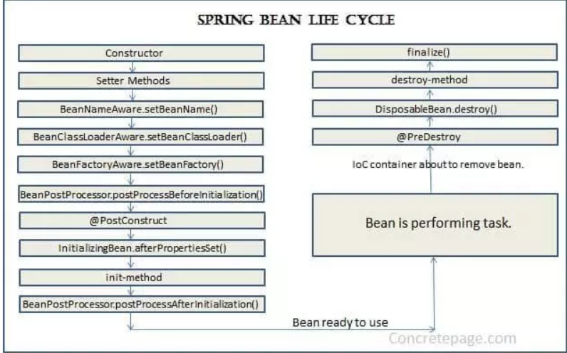
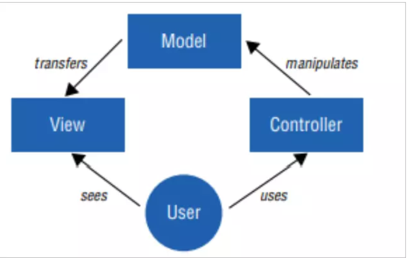
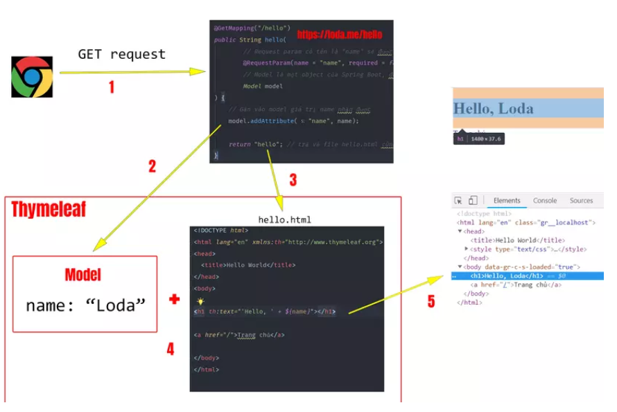

````markdown
# I. Spring Bean

## 1.1. Spring Bean và Spring IoC Container

Bean đơn giản là một **đối tượng (object)** được khởi tạo, cấu hình và quản lý bởi **Spring IoC Container**. Chúng là các đối tượng cấu thành nên **“xương sống” của ứng dụng Spring** của bạn.

### IoC Container

**IoC Container (Inversion of Control Container)** là một thành phần phần mềm chịu trách nhiệm **tạo ra, lắp ráp, cấu hình và quản lý vòng đời của các đối tượng** (thường gọi là các bean hay instance) trong một ứng dụng.

### Nếu không có IoC Container

```java
Food food = new Food();
Animal animal = new Animal(food);
Person person = new Person(animal);
````

* `new Food()` → tạo đối tượng `Food`
* `new Animal(food)` → truyền dependency `Food` vào `Animal`
* `new Person(animal)` → truyền dependency `Animal` vào `Person`

Khi không có IoC Container, lập trình viên phải tự:

* Tạo đối tượng
* Truyền dependency
* Quản lý đối tượng
* Quyết định đối tượng nào sử dụng đối tượng nào

### Khi có Spring IoC Container

**Spring sẽ đứng giữa để quản lý các đối tượng.**

```java
@Component
public class Animal {
}
```

→ Spring tạo và quản lý một **Bean** từ lớp `Animal`.

```java
@Component
public class Person {

    private final Animal animal;

    public Person(Animal animal) {
        this.animal = animal;
    }
}
```

→ Spring kiểm tra trong Container có `Animal Bean` không
→ Có
→ Tạo `Person(animal)`

### Hai loại Container chính của Spring

Spring cung cấp hai loại Container chính:

#### BeanFactory

**BeanFactory** là **giao diện gốc** (root interface) cốt lõi của Spring IoC Container, chịu trách nhiệm **khởi tạo, cấu hình và quản lý vòng đời của các Bean** trong ứng dụng Java.

#### ApplicationContext

**ApplicationContext** là bản mở rộng của `BeanFactory`. Trong hầu hết các ứng dụng hiện đại, `ApplicationContext` là lựa chọn phổ biến.

---

### BeanFactory

**Cơ chế hoạt động:**

BeanFactory sử dụng nguyên lý **tiêm phụ thuộc (Dependency Injection - DI)** để quản lý các mối quan hệ giữa các Bean với nhau.

**Khởi tạo lười (Lazy Initialization):**

Các Bean trong `BeanFactory` chỉ được tạo ra khi có yêu cầu gọi trực tiếp thông qua phương thức `getBean()`, giúp tiết kiệm tài nguyên bộ nhớ.

---

## 1.2. Các loại Bean

### Singleton

**Singleton (mặc định):**

IoC Container chỉ tạo đúng **duy nhất một đối tượng** từ lớp Bean này.

### Prototype

**Prototype:**

Trả về **một đối tượng Bean riêng biệt cho mỗi lần sử dụng**.

---

## 1.3. Cách tạo Bean

### Cấu hình dựa trên XML

Là cách truyền thống của Spring.

### Cấu hình dựa trên Annotation

Là cách phổ biến nhất hiện nay, định nghĩa Bean trên lớp Java bằng các Annotation.

```java
@Component
```

`@Component`: Annotation chung cho bất kỳ thành phần nào được Spring quản lý.

```java
@Service
```

`@Service`: Dùng cho các lớp **logic nghiệp vụ** (lớp Service).

```java
@Repository
```

`@Repository`: Dùng cho các lớp **truy cập dữ liệu** (lớp Repository/DAO).

```java
@Controller
```

`@Controller`: Dùng cho các lớp **xử lý yêu cầu web** (lớp Controller).

### Cấu hình dựa trên JavaConfig

Định nghĩa Bean trên lớp Java được đánh dấu bởi `@Configuration`.

```java
@Configuration
// Đánh dấu lớp này chứa các định nghĩa Bean

public class AppConfig {

    @Bean
    // Đánh dấu phương thức này sẽ tạo ra một Bean

    public MyRepository myRepository() {
        return new MyRepository();
    }
}
```

---

## 1.4. Vòng đời Bean

### 1. Instantiation

Spring Container **tạo instance của Bean**.

### 2. Populate Properties

Spring **tiêm các phụ thuộc (DI)**.

### 3. Initialization

Gọi các **callback khởi tạo**.

Đây là nơi bạn có thể thực hiện các công việc thiết lập cần thiết sau khi Bean đã được tạo và các phụ thuộc đã được tiêm.

Ví dụ:

* Mở kết nối
* Nạp bộ nhớ đệm (cache)

### 4. Ready for Use

Bean đã **sẵn sàng để sử dụng** và nằm trong Container, chờ được sử dụng.

### 5. Destruction

Khi Container đóng lại, Spring gọi các **callback hủy**.

Đây là nơi bạn có thể thực hiện các công việc dọn dẹp.

Ví dụ:

* Đóng kết nối
* Giải phóng tài nguyên





# II. Spring MVC

Spring MVC là một **framework ứng dụng web** thuộc **Spring Framework**, hoạt động dựa trên mô hình **MVC (Model - View - Controller)** nhằm tách biệt các tầng logic trong ứng dụng.



**Annotations** là các **ghi chú hoặc chỉ dẫn đặc biệt** được gắn vào mã nguồn. Những ghi chú này cho Spring MVC biết các phần khác nhau trong mã nguồn nên hoạt động với nhau như thế nào. Có thể hiểu chúng giống như những **thẻ đánh dấu nhỏ**, giúp Spring MVC hiểu mã nguồn tốt hơn và giúp việc xây dựng ứng dụng web dễ dàng hơn.

### @Controller

`@Controller` là một **annotation cấp lớp (class-level annotation)**.

Nó đánh dấu một class làm nhiệm vụ:

- Tiếp nhận các **HTTP Request** từ người dùng.
- Điều hướng logic.
- Trả về giao diện.

> **Lưu ý:** `@Controller` là một dạng chuyên biệt của `@Component`, vì vậy class được đánh dấu `@Controller` có thể được Spring tự động phát hiện và quản lý bởi IoC Container.

### Thymeleaf

**Thymeleaf** là một **Java Template Engine**.

Nó có nhiệm vụ xử lý và **sinh ra (generate)** các file như:

- HTML
- XML
- ...

Các file HTML do Thymeleaf tạo ra là kết quả của việc kết hợp:

```text
Dữ liệu
+
Template
+
Quy tắc xử lý
↓
File HTML hoàn chỉnh


````



---

# III. Một số Annotation thường dùng trong Spring

## 3.1. Annotation

**Annotation** là các ghi chú hoặc chỉ dẫn đặc biệt được gắn vào mã nguồn.

Những ghi chú này giúp Spring biết cách các thành phần khác nhau trong ứng dụng nên hoạt động và kết hợp với nhau như thế nào.

Có thể hiểu đơn giản:

```text
Annotation = Thẻ đánh dấu cho Spring biết class / method / field này có vai trò gì
```

---

## 3.2. Các Annotation phổ biến

### @Component

`@Component` là annotation chung nhất.

Nó đánh dấu một class là một **thành phần được Spring quản lý**.

Nếu một class không thuộc bất kỳ tầng cụ thể nào như:

* Web
* Service
* Data

thì có thể dùng:

```java
@Component
```

---

### @Autowired

`@Autowired` là annotation phổ biến cho **Dependency Injection (DI)**.

Có thể đặt nó trên:

* Constructor
* Setter method
* Field

Spring sẽ tìm kiếm một **Bean phù hợp với kiểu dữ liệu của dependency** và tiêm dependency đó vào đối tượng.

### Injection qua Constructor

```java
@Autowired
public OrderService(ProductService productService) {
    this.productService = productService;
}
```

> **Constructor Injection** thường được khuyến nghị hơn Field Injection vì dependency được thể hiện rõ ràng và có thể đảm bảo dependency tồn tại ngay khi đối tượng được tạo.

---

### @Bean

`@Bean` đánh dấu một phương thức bên trong một class được đánh dấu `@Configuration`.

Phương thức này sẽ:

1. Tạo một đối tượng.
2. Cấu hình đối tượng.
3. Trả về đối tượng đó.

Đối tượng được trả về sẽ được đăng ký như một **Bean trong Spring Container**.

Tên của Bean mặc định là **tên của phương thức**.

Ví dụ:

```java
@Configuration
public class AppConfig {

    @Bean
    public MyRepository myRepository() {
        return new MyRepository();
    }
}
```

Ở đây:

```text
myRepository()
↓
tạo ra MyRepository
↓
Spring đăng ký đối tượng này thành một Bean
↓
Tên Bean mặc định: "myRepository"
```

---

## @SpringBootApplication

`@SpringBootApplication` là một **meta-annotation**.

**Meta-annotation** là một annotation được tạo thành từ nhiều annotation khác.

Annotation này thường được đặt tại class chứa hàm `main`.

```java
@SpringBootApplication
public class Application {

    public static void main(String[] args) {
        SpringApplication.run(Application.class, args);
    }
}
```

`@SpringBootApplication` bao gồm ba annotation chính:

### 1. @SpringBootConfiguration

Đánh dấu class là **nguồn cung cấp các định nghĩa Bean** cho Spring Container.

Nó cho phép định nghĩa Bean trực tiếp bên trong class ứng dụng.

---

### 2. @EnableAutoConfiguration

Bật cơ chế **tự động cấu hình** của Spring Boot.

Spring Boot sẽ tự động cấu hình các Bean dựa trên những thư viện và dependency có trong **classpath**.

---

### 3. @ComponentScan

Bật cơ chế **quét các thành phần của Spring** như:

```text
@Controller
@Service
@Repository
@Component
```

Spring sẽ quét trong **package chứa class chính** và các **package con** của nó để tìm các thành phần được đánh dấu bằng các annotation trên.

---

# IV. Lombok

## 4.1. Lombok là gì?

**Lombok** là một thư viện can thiệp vào quá trình **biên dịch (compile-time)** của Java.

Nó giúp tự động sinh ra những đoạn mã rườm rà và lặp đi lặp lại như:

* Getter
* Setter
* Constructor
* `toString()`
* `equals()`
* `hashCode()`

chỉ bằng các annotation.

Nhờ đó, class trở nên **ngắn gọn hơn và dễ bảo trì hơn**.

---

## 4.2. @Getter, @Setter và @ToString

```java
import lombok.Getter;
import lombok.Setter;
import lombok.ToString;

@Getter
@Setter
@ToString
public class Student {

    private int id;
    private String name;
    private double gpa;
}
```

### Cách dùng

```java
Student s = new Student();

s.setId(1);

String name = s.getName();
```

→ Các phương thức `get` và `set` được Lombok **tự động sinh ra**.

Ví dụ:

```java
s.setId(1);
```

tương đương với việc bạn tự viết:

```java
public void setId(int id) {
    this.id = id;
}
```

Tương tự:

```java
s.getName();
```

tương đương với:

```java
public String getName() {
    return this.name;
}
```

---

## 4.3. @Data

`@Data` kết hợp nhiều annotation của Lombok thành một annotation duy nhất:

```text
@Getter
@Setter
@ToString
@EqualsAndHashCode
@RequiredArgsConstructor
```

Ví dụ:

```java
@Data
public class Student {

    private int id;
    private String name;
    private double gpa;
}
```

Có thể hiểu:

```text
@Data
=
@Getter
+
@Setter
+
@ToString
+
@EqualsAndHashCode
+
@RequiredArgsConstructor
```

---

## 4.4. @Builder

`@Builder` giúp tự động triển khai **Builder Pattern** trong Java mà không cần viết các đoạn mã khởi tạo dài dòng.

### Ví dụ

```java
@Builder
public class User {

    private String name;
    private int age;
    private float gpa;
}
```

### Không có Builder

```java
User user = new User("Alice", 25, 3.9);
```

→ Nhìn vào câu lệnh này khó biết:

```text
25 là gì?
3.9 là gì?
```

### Có @Builder

```java
User user = User.builder()
    .name("Alice")
    .age(25)
    .gpa(3.9)
    .build();
```

→ Nhìn vào code có thể hiểu ngay:

```text
name = Alice
age = 25
gpa = 3.9
```

---

## 4.5. Các loại Constructor

### @AllArgsConstructor / @NoArgsConstructor

Tự động tạo constructor:

* `@AllArgsConstructor` → Constructor chứa **tất cả các field**.
* `@NoArgsConstructor` → Constructor **không có tham số**.

---

### @RequiredArgsConstructor

Tự động tạo constructor cho:

* Tất cả các field `final`.
* Các field được đánh dấu `@NonNull`.

Ví dụ:

```java
@RequiredArgsConstructor
public class Student {

    private final int id;
    // Có trong constructor

    @NonNull
    private String name;
    // Có trong constructor

    private double gpa;
    // Bị bỏ qua trong constructor
}
```

Lombok sẽ tạo constructor tương đương:

```java
public Student(int id, String name) {
    this.id = id;
    this.name = name;
}
```

---

# V. Log trong Spring Boot

## 5.1. SLF4J và Log4j / Logback

### SLF4J

**SLF4J (Simple Logging Facade for Java)** về bản chất chỉ là một **giao diện (Interface) tiêu chuẩn**, không trực tiếp thực hiện việc ghi log.

Nó cung cấp các hàm API chuẩn như:

```java
log.info()
log.debug()
log.warn()
log.error()
```

Nhờ đó, mã nguồn không bị phụ thuộc cứng vào một thư viện ghi log cụ thể.

Có thể hiểu:

```text
Ứng dụng
   ↓
SLF4J
   ↓
Logback / Log4j2
```

---

### Log4j / Logback

Đây là các **thư viện thực thi (Implementation)** nằm phía dưới SLF4J.

Chúng chịu trách nhiệm xử lý việc:

* Ghi log ra file.
* Ghi log ra console.
* Đẩy log lên server.

> **Lưu ý:** Mặc định Spring Boot sử dụng **Logback**, nhưng hoàn toàn có thể loại bỏ Logback và cấu hình để sử dụng **Log4j2** nếu cần.

---

# 5.2. Cách dùng SLF4J

Ví dụ:

```java
import org.slf4j.Logger;
import org.slf4j.LoggerFactory;

import org.springframework.boot.CommandLineRunner;
import org.springframework.boot.SpringApplication;
import org.springframework.boot.autoconfigure.SpringBootApplication;

@SpringBootApplication
public class LoggingDemoApplication implements CommandLineRunner {

    private static final Logger logger =
            LoggerFactory.getLogger(LoggingDemoApplication.class);

    // LoggerFactory để lấy logger dùng chung

    // getLogger(LoggingDemoApplication.class)
    // để lấy logger cho class LoggingDemoApplication

    public static void main(String[] args) {

        SpringApplication.run(
            LoggingDemoApplication.class,
            args
        );

        // Chạy Spring Boot
    }

    @Override
    public void run(String... args) {

        logger.info("Application started");

        // INFO thường dùng để ghi lại
        // hoạt động bình thường đáng quan tâm của ứng dụng.

        logger.debug("Debugging details...");

        // DEBUG dùng cho các thông tin
        // phục vụ lập trình viên gỡ lỗi.

        logger.warn("This is a warning");

        // WARN dùng khi có điều gì đó bất thường
        // hoặc đáng chú ý, nhưng chưa nhất thiết là lỗi nghiêm trọng.

        logger.error("An error occurred");

        // ERROR dùng khi có lỗi nghiêm trọng,
        // thường đi kèm với try-catch.
    }
}
```

### Ý nghĩa các mức Log

```text
INFO
→ Hoạt động bình thường đáng quan tâm.

DEBUG
→ Thông tin chi tiết phục vụ việc gỡ lỗi.

WARN
→ Có điều gì đó bất thường hoặc đáng chú ý,
  nhưng chưa nhất thiết là lỗi nghiêm trọng.

ERROR
→ Có lỗi nghiêm trọng xảy ra.
```

---

# 5.3. Lưu ý khi sử dụng Logger

## Không nên dùng dấu `+` để nối chuỗi

### Không nên

```java
logger.info("User " + username + " logged in");
```

### Nên

```java
logger.info("User {} logged in", username);
```

Cách dùng `{}` giúp logger xử lý tham số mà không cần tự nối chuỗi trước.

---

## Khi có Exception, truyền Exception vào Logger

### Không nên

```java
catch (Exception e) {
    logger.error("Something went wrong");
}
```

→ Cách này chỉ ghi thông báo lỗi nhưng **không ghi lại thông tin của Exception**.

### Nên

```java
catch (Exception e) {
    logger.error("Something went wrong", e);
}
```

→ Logger sẽ ghi:

```text
Thông báo lỗi
+
Thông tin Exception
+
Stack Trace
```

Nhờ đó dễ xác định nguyên nhân gây lỗi hơn.
