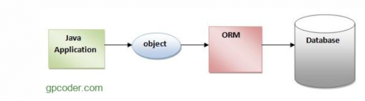
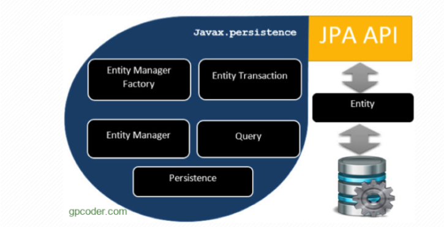
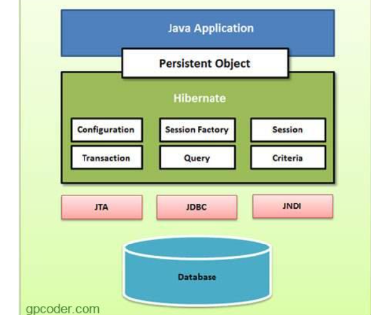
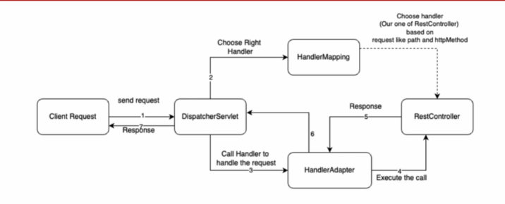

# JPA là gì? Hibernate là gì?

## 1.1.1 JPA là gì

JPA là tập hợp các quy tắc, giao diện (`interface`) và `annotation` dùng để ánh xạ các đối tượng Java với cơ sở dữ liệu quan hệ thông qua công nghệ ORM cho phép quản lý dữ liệu quan hệ trong cơ sở dữ liệu theo một cách hướng đối tượng.

**Ví dụ:** bảng USER với các cột (Id, username, password) sẽ tương ứng với lớp User.java với các thuộc tính Id, username, password.

### Lợi ích

* **Làm việc trực tiếp với Object:** Thay vì viết các câu lệnh SQL phức tạp, bạn thao tác trực tiếp với các đối tượng Java (POJO).
* **Độc lập cơ sở dữ liệu:** Giúp dễ dàng chuyển đổi qua lại giữa các loại cơ sở dữ liệu khác nhau (như MySQL, PostgreSQL, Oracle) mà ít phải sửa đổi mã nguồn.
* **Giảm thiểu mã nguồn:** Tự động hóa các thao tác thêm, sửa, xóa, tìm kiếm dữ liệu (CRUD)




ORM là viết tắt của Object Relational Mapping, là một quá trình chuyển đổi dữ liệu từ ngôn ngữ hướng đối tượng sang cơ sở dữ liệu quan hệ và ngược lại.

ORM có xử lý thao tác mà không cần qun tâm loại cơ sở dữ liệu nào (SQL Server, MySQL, …) hay loại thao tác (INSERT, UPDATE,, …)

### Các kiểu ánh xạ ORM gồm:

* **One-to-one:** Quan hệ này được biểu diễn bởi `@OneToOne` annotation. Ở đây, instance của mỗi entity được liên kết với một instance duy nhất của entity khác.
* **One-to-many:** Quan hệ này được biểu diễn bởi `@OneToMany` annotation. Trong mối quan hệ này, một instance của một entity có thể liên kết với nhiều hơn một instance của entity khác.
* **Many-to-one:** Ánh xạ này được định nghĩa bởi `@ManyToOne` annotation. Trong mối quan hệ này, nhiều instance của một entity có thể liên kết với một instance duy nhất của entity khác.
* **Many-to-many:** Quan hệ này được biểu diễn bởi `@ManyToMany` annotation. Ở đây, nhiều instance của một entity có thể liên kết với nhiều instance của entity khác. Trong ánh xạ này, bất kỳ phía nào cũng có thể là phía sở hữu.

## 1.1.2 kiến trúc JPA

JPA bao gồm ba thành phần chính là: Entity, EntityManager, và EntityManagerFactory. Ngoài ra còn có, EntityTransaction, Persistence, Query.



### Entity

Entity là các đối tượng thể hiện tương ứng 1 bảng trong cơ sở dữ liệu. Entity thường là các class POJO đơn giản, chỉ gồm các phương thức getter, setter.

### EntityManager

EntityManager là một interface cung cấp các API cho việc tương tác với các Entity.

Một số chức năng cơ bản của EntityManager như:

* **Persist:** phương thức này dùng để lưu một thực thể mới tạo vào cơ sở dữ liệu.
* **Merge:** dùng để cập nhật trạng thái của entity vào cơ sở dữ liệu.
* **Remove:** xóa một instance của entity.

### EntityManagerFactory

EntityManagerFactory được dùng để tạo ra một instance của EntityManager.

## 1.2.1 Hibernate là gì

Là framework để ánh xạ (mapping) giữa các đối tượng trong Java và các bảng trong cơ sở dữ liệu quan hệ

Hình dung đơn giản: JPA giống như một bản thiết kế ngôi nhà, còn Hibernate là đội thợ xây thực sự thi công ngôi nhà đó dựa trên bản thiết kế.

### Đặc Điểm Nổi Bật Của Hibernate

* **ORM (Object-Relational Mapping):** Hibernate cung cấp khả năng ánh xạ tự động giữa các đối tượng trong Java và các bảng cơ sở dữ liệu mà không cần phải viết nhiều mã SQL thủ công.
* **HQL (Hibernate Query Language):** Một ngôn ngữ truy vấn tương tự SQL nhưng hướng đối tượng, giúp lập trình viên làm việc với dữ liệu dễ dàng hơn.
* **Tương Thích Nhiều CSDL:** Hibernate có thể hoạt động với hầu hết các hệ quản trị cơ sở dữ liệu phổ biến như MySQL, PostgreSQL, Oracle, Microsoft SQL Server,...
* **Caching:** Hibernate sử dụng cơ chế caching để tăng hiệu suất, giảm số lượng truy vấn đến cơ sở dữ liệu.

## 1.2.2 kiến trúc Hibernate

Kiến trúc Hibernate bao gồm nhiều đối tượng như đối tượng persistent, session factory, transaction factory, connection factory, session, transaction, …



### thành phần chính:

#### SessionFactory

Là một factory cho các session, chịu trách nhiệm tạo và quản lý session.

#### Session

Là giao diện chính để tương tác với cơ sở dữ liệu, thực hiện các hoạt động như lưu trữ, cập nhật, và xóa dữ liệu.

#### Transaction

Hỗ trợ quản lý các giao dịch (transaction) nhằm đảm bảo tính toàn vẹn dữ liệu thường dùng dirty checking. Tức là nếu có một lỗi xảy ra trong transaction thì tất cả các tác vụ thực hiện sẽ thất bại.

#### Query

Được sử dụng để thực hiện các truy vấn với cơ sở dữ liệu thông qua HQL.

* **Persistence Context (Bối cảnh lưu trữ):** trong Hibernate về bản chất là một thùng chứa trung gian đóng vai trò đồng thời là bộ nhớ đệm cấp một (First-Level Cache) và bộ theo dõi thay đổi (Change Tracker). Nó chịu trách nhiệm quản lý vòng đời của các thực thể trong một Session/Transaction và tự động chuyển đổi các thay đổi trên đối tượng Java thành câu lệnh SQL tương ứng để cập nhật vào CSDL.

## 1.2.3 sự khác nhau giữa Hibernate và JPA

### Định nghĩa:

* **JPA:** Là một tập hợp các giao diện (interfaces), quy tắc và annotation tiêu chuẩn do cộng đồng định ra nhằm thống nhất cách quản lý dữ liệu quan hệ trong các ứng dụng Java. Bản thân JPA không trực tiếp xử lý lưu trữ dữ liệu mà cần một công cụ thực thi bên dưới.
* **Hibernate:** Là một công cụ ORM (Object-Relational Mapping) thực tế. Hibernate đóng vai trò là nhà cung cấp (provider) thực thi các quy chuẩn của JPA.

### Đối tượng quản lý

* **JPA:** làm việc với `@Entity`, `@EntityManager`, `@EntityManagerFactory`
* **Hibernate:** làm việc với `@Session`, `@SessionFactory` Session (thực chất một Session của Hibernate chính là một EntityManager)

## 1.2.4

* **save/persist():** được dùng để thêm một thể hiện thực thể mới vào persistence context tức là chuyển đổi một thể hiện từ trạng thái tạm thời sang trạng thái lưu trữ lâu dài.

```java
session.persist(user);
```

* **get():** sẽ tìm Entity theo Primary Key

```java
User user = session.get(User.class, 1L);
```

* **remove():** đánh dấu Entity sẽ xóa sau khi flush/commit

```java
session.remove(user);
```

* **detach():** đưa Entity ra khỏi Persistence context

```java
session.detach(user);
```

* **flush():** đồng bộ những thay đổi từ Persistence Context xuống cơ sở dữ liệu
* **commit():** xác nhận Transaction

### Ví dụ code

```java
import javax.persistence.*;

@Entity
@Table(name = "users")
public class User {
    # Hibernate đọc các annotationsntrên class User để hiểu cấu trúc.
    # @Entity: Khai báo class User là một thực thể quản lý bởi JPA/Hibernate.
    # @Table(name = "users"): Chỉ định tên bảng tương ứng trong cơ sở dữ liệu là users.
    # @Id và @GeneratedValue: Xác định khóa chính và cách sinh giá trị tự động
    # @Column(name = "column_name"): Ánh xạ các thuộc tính sang các cột trong bảng.

    @Id
    @GeneratedValue(strategy = GenerationType.IDENTITY)
    private Long id;
    
    @Column(name = "username")
    private String username;
    
    @Column(name = "email")
    private String email;

    // Getters và Setters
}

Session session = sessionFactory.openSession();
Transaction transaction = session.beginTransaction();
User user = new User();
user.setName("Nguyễn Văn A");
user.setEmail("vana@example.com");
session.persist(user);
session.flush();
transaction.commit();
session.close();
```

# 2. Kiến trúc 4 lớp Spring Boot

Kiến trúc phân tầng của ứng dụng Spring Boot thường được mở rộng thành 4 lớp (4-tier architecture) nhằm tách biệt rõ ràng các trách nhiệm từ giao diện người dùng cho đến cơ sở dữ liệu

## 1. Presentation Layer

* Có trách nhiệm xử lý tất cả các HTTP request gửi đến và gửi phản hồi phù hợp trở lại client.

### Responsibilities

* Xử lý các phương thức HTTP như GET, POST, PUT, DELETE
* Cung cấp RESTful APIs bằng cách sử dụng controllers
* Thực hiện validation request
* Quản lý các authentication entry points
* Chuyển đổi các đối tượng Java thành JSON và ngược lại
* Chuyển các request đã được validation đến Business Layer

### Common Components

* `@RestController` / `@Controller`
* `@RequestMapping`, `@GetMapping`, `@PostMapping`
* `@RequestBody`, `@PathVariable`

## 2. Business Logic Layer

* Nơi tập trung toàn bộ các xử lý logic nghiệp vụ (Business Logic) của ứng dụng.

### Responsibilities

* Triển khai các quy tắc nghiệp vụ và quy trình xử lý
* Xử lý và validation dữ liệu
* Xử lý logic xác thực và phân quyền (sử dụng Spring Security nếu cần)
* Quản lý các giao dịch bằng `@Transactional`
* Giao tiếp với Persistence Layer để lấy hoặc lưu trữ dữ liệu

### Common Components

* `@Service`
* `@Transactional`

## 3. Data Access Layer

* Persistence Layer chịu trách nhiệm tương tác với cơ sở dữ liệu và logic truy cập dữ liệu. Nó che giấu các thao tác cơ sở dữ liệu bên dưới khỏi phần còn lại của ứng dụng.

### Responsibilities:

* Ánh xạ các đối tượng Java tới các bảng cơ sở dữ liệu bằng cách sử dụng các framework ORM
* Thực hiện các thao tác CRUD (Create, Read, Update, Delete)
* Quản lý các giao dịch cơ sở dữ liệu
* Hỗ trợ cả cơ sở dữ liệu quan hệ và NoSQL

### Technologies Used

* Spring Data JPA
* Hibernate

### Common Components

* `@Repository`
* `JpaRepository`, `CrudRepository`
* `@Entity`, `@Id`, `@Table`

## 4. Database / Model Layer

* Database Layer chứa cơ sở dữ liệu thực tế nơi dữ liệu của ứng dụng được lưu trữ.

### Giải thích:

* Client (frontend hoặc API consumer) gửi một HTTP request (GET, POST, PUT, DELETE) đến ứng dụng.
* Request được xử lý bởi Controller Layer, nơi ánh xạ request tới một handler method cụ thể.
* Service Layer xử lý business logic và giao tiếp với Persistence Layer để lấy hoặc sửa đổi dữ liệu.
* Persistence Layer tương tác với Database Layer bằng Spring Data JPA hoặc R2DBC, thường thông qua một Repository Class mở rộng các CRUD services.
* Phản hồi đã được xử lý được trả về dưới dạng JSON.
* Spring Boot Actuator có thể được sử dụng để giám sát và kiểm tra tình trạng.

# 3. Request flow

## Step 1 — Client gửi HTTP Request

```http
GET http://localhost:8080/users/1
```

## Step 2 — Filter

Kiểm tra request hợp lệ không

## Step 3 — DispatcherServlet

DispatcherServlet là Front Controller (người điều phối request) trong Spring MVC. Nó nhận mọi yêu cầu HTTP từ client và điều phối chúng đến các thành phần xử lý thích hợp trong ứng dụng



## Step 4 — HandlerMapping

Ánh xạ các HTTP request từ người dùng đến đúng Controller (hoặc Handler) xử lý

HandlerMapping xem request Get /user/1 thuộc Controller nào

```java
@RestController
@RequestMapping("/users")
public class UserController {

    @GetMapping("/{id}")
    public User getUser(@PathVariable Long id) {
        ...
    }
}
```

-> Controller cho request là `UserController.getUser()`

## Step 4 — HandlerAdapter

Đây là phần nằm bên trong quá trình DispatcherServlet xử lý request. Nó có nhiệm vụ gọi handler đó

Gọi method id 1 từ request gắn vào `@PathVaraible` rồi gọi `UserController.getUser(1)`

## Step 5 — Controller

cầu nối trung gian giữa client và tầng xử lý nghiệp vụ, chịu trách nhiệm nhận HTTP request, điều phối dữ liệu và trả về phản hồi

Sau khi method trên được gọi thì Controller sẽ gửi yêu cầu cho Service

## Step 6 - Service

Đóng vai trò là nơi xử lý toàn bộ logic nghiệp vụ của một request

Các logic nghiệp vụ có thể là

* validation
* Tính toán, chuyển đổi hoặc xử lý dữ liệu theo yêu cầu của bài toán
* Quyết định dữ liệu nào cần lưu trữ hoặc cần gọi đi đâu tiếp theo.

Sau khi xử lý logic xong sẽ gọi Repository để làm việc với DB

## Step 7 - Repository

tầng trung gian chịu trách nhiệm giao tiếp trực tiếp với cơ sở dữ liệu hoặc nguồn dữ liệu bên ngoài để truy vấn và thao tác dữ liệu

Dùng JPA, Hibernate làm việc với Database

Database trả dữ liệu -> Hibernate chuyển thành các object -> các object quay về controller -> biến dữ liệu thành JSON gửi về client

# 4. Cấu hình DataSource

DataSource là một thành phần (`interface`) đóng vai trò là nguồn cung cấp kết nối đến cơ sở dữ liệu cho ứng dụng

```text
Repository -> JPA - > Hibernate -> DataSource -> Connection -> Database
```

### Cấu hình bằng application.properties File

```java
@Bean
public DataSource getDataSource() { 
 DataSourceBuilder dataSourceBuilder = DataSourceBuilder.create(); 
 dataSourceBuilder.username("SA"); ## -> tài khoản SQL sử dụng
 dataSourceBuilder.password(""); 
 return dataSourceBuilder.build(); 
}
```

### trong src/main/resources/application.properties viết thêm

```properties
spring.datasource.url=jdbc:MySQL:(port MySQL):(tên database)
spring.datasource.driver-class-name=com.mysql.cj.jdbc.Driver
```

### Hoặc đơn giản nhất cấu hình bằng `@Configuration` annotation

```java
@Configuration
public class DataSourceConfig {
    
    @Bean
    public DataSource getDataSource() {
        DataSourceBuilder dataSourceBuilder = DataSourceBuilder.create();
        dataSourceBuilder.driverClassName("org.h2.Driver");
        dataSourceBuilder.url("jdbc:h2:mem:test");
        dataSourceBuilder.username("SA");
        dataSourceBuilder.password("");
        return dataSourceBuilder.build();
    }
}
```

# 5. Các annotation

## 5.1 `@RestController`

Annotation `@RestController` trong Spring Boot dùng để đánh dấu một lớp (class) là bộ điều khiển chuyên xây dựng các dịch vụ web dạng RESTful API

Là sự kết hợp của `@Controller` và `@ResponseBody`

### So sánh với Controller

* **Controller**

```java
@Controller
public class HomeController {
    @GetMapping("/home")
    public String home(){
        return "home";
    }
}
```

Controller dùng chủ yếu cho Web MVC trả về các View như code trên sẽ trả về home.html

* **RestController**

```java
@RestController
public class UserController {
    @GetMapping("/user")
    public User user(){
        return new User(1,"Tuan");
    }
}
```

RestController dùng cho Rest API. Như code trên

* RestController có tác dụng đăng ký UserController thành Bean và quản lí trong Containner
* Tự động convert object thành JSON -> HTTP response

## 5.2 `@Service`

`@Service` trong dùng để đánh dấu một class chứa logic nghiệp vụ của ứng dụng

### Ý nghĩa:

* Đăng ký class thành Spring Bean
* Cho phép DI
* Hỗ trợ quản lý Transaction

## 5.3 `@Repository`

`@Repository` là một annotation dùng để đánh dấu một class thuộc Data Access Layer (DAO layer).

### Ý nghĩa

* Đăng ký class thành Spring Bean
* Cho phép DI

## 5.4 `@Entity`, `@Id`

`@Entity` là một annotation cốt lõi của JPA dùng để đánh dấu một lớp Java thành một thực thể ánh xạ tới một bảng trong cơ sở dữ liệu

* `@Id`: Đánh dấu trường là khóa chính của bảng.
* `@GeneratedValue`: Cấu hình cách tự động sinh giá trị cho khóa chính (ví dụ: GenerationType.IDENTITY).
* `@Column`: Ánh xạ trường Java với cột cụ thể trong cơ sở dữ liệu
* `@Transient`: Đánh dấu một trường không muốn lưu trữ hoặc ánh xạ vào cơ sở dữ liệu

## 5.5 `@Transactional`

`@Transactional` trong Spring Boot dùng để quản lý giao dịch (transaction) tự động, giúp đảm bảo các thao tác với cơ sở dữ liệu tuân theo nguyên tắc ACID (tất cả cùng thành công hoặc tất cả bị hủy bỏ nếu có lỗi)

### Cách hoạt động

* **Tự động hóa:** Tự động gọi lệnh begin (bắt đầu), commit (lưu) khi thành công, hoặc rollback (hoàn tác) khi gặp lỗi.
* **Phạm vi áp dụng:** Thường đặt ở tầng Service

## 5.6 `@Query`

`@Query` trong JPA dùng để định nghĩa các câu lệnh truy vấn tùy chỉnh trực tiếp bên trong interface Repository

Annotation này giúp bạn viết JPQL (Java Persistence Query Language) hoặc Native SQL

### Ví dụ

#### JPQL

```java
public interface UserRepository extends JpaRepository<User, Long> {
    
    @Query("SELECT u FROM User u WHERE u.email = :email")
    User findByEmailCustom(@Param("email") String email);
}
```

#### Native SQL

```java
public interface UserRepository extends JpaRepository<User, Long> {
    
    @Query(value = "SELECT * FROM users WHERE status = ?1", nativeQuery = true)
    List<User> findAllActiveUsers(int status);
}
```
